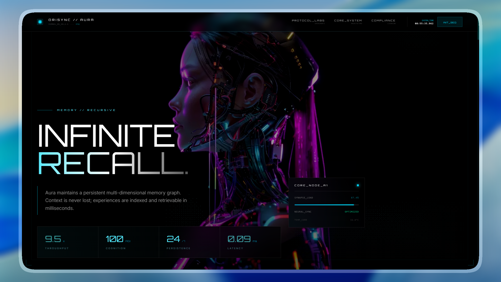

# 🤖 Aura Robotics Landing Page

> **Day 10/30 of the "Building 1 AI-Generated Landing Page Every Day" Challenge**



## 🚀 About

Conceptual landing page for **Aura Robotics**, a **humanoid AGI robot that bridges the gap between digital cognition and physical actuation**, developed with **Next.js 16**, **TypeScript**, and **Tailwind CSS 4**. This project is the tenth realization of an ambitious challenge: creating **1 complete and functional mockup per day using AI**.

Aura is engineered to deliver superhuman performance 10x faster and stronger than a human. The landing page is designed to convey **technical supremacy**, **ethical governance**, **embodied intelligence**, and **high-performance robotics** through a dense, "bento-box" style aesthetic with live telemetry and simulation-grade animations.

Live URL: [https://aura-landing.adrielzimbril.com](https://aura-landing.adrielzimbril.com)

## 🎨 Design & Aesthetic Decisions (The "Why")

For this tenth day, the theme focuses on **high-end humanoid robotics, neural-mesh syncing, and ethical safety kernels**.

- **Robotic Lab Aesthetic:** The interface uses a "Midnight Void" palette with high-contrast cyan accents, hair-line borders, and persistent scanning lines to simulate an operator's workstation.
- **Bento Logic & Densification:** Every square inch of the layout is packed with technical detail—telemetry grids, throughput monitors, and diagnostic nodes—ensuring no "empty space" remains, reflecting the complexity of AGI systems.
- **Motion Smoothness:** Animations are carefully tuned with custom cubic-beziers to feel fluid and "premium," avoiding the jerky transitions common in simpler designs.
- **Simulation Reality:** Interactive elements like the "Law Chat" and "System Flow" panels simulate real-time reasoning and safety auditing, making the product feel "alive."
- **Premium Identity:** The branding is integrated into the UI itself, with navigation labels like `NEURAL_RECALL` and `ETHICS_KERNEL` replacing generic terms.

## 🧩 Key Sections

- **🌟 Hero Section:** Grabs attention with large Orbitron typography, a floating viewfinder overlay, and a live status card showing neural sync and synapse load.
- **🧠 Embodied Bento:** Showcases the core capabilities—embodied cognition, superhuman memory, and strength amplification—through interactive telemetry cards.
- **⚖️ Directive Audit:** A real-time chat simulation demonstrating the Robotic Directive Alignment Protocol (The Three Laws) in action.
- **📊 Live Metrics:** A dedicated section for real-time system performance monitoring, featuring animated throughput and latency graphs.
- **🏢 Modern Footer:** A technical brand close with system audit logs and secure kernel boot status.

## 🛠️ Tech Stack

This mockup was built with cutting-edge technologies from the React ecosystem:

- **[Next.js 16](https://nextjs.org/)** (App Router)
- **[React 19](https://react.dev/)**
- **TypeScript** for scalable component architecture and safer iteration.
- **[Tailwind CSS v4](https://tailwindcss.com/)** for design tokens, utilities, and modern CSS support.
- **Three.js & Postprocessing** for the ambient Pixel Blast visual layer.
- **[Motion/React](https://motion.dev/)** for high-performance animations and transitions.
- **[Lucide React](https://lucide.dev/)** for clean, consistent iconography.
- **Next Font** with **Orbitron**, **Inter**, and **Geist Mono** for optimized typography.

## 🚀 Quick Start

```bash
# Install dependencies
pnpm install

# Run development server
pnpm dev
```

Open [http://localhost:3000](http://localhost:3000) in your browser to see the result.

## 🌌 Let's meet in space (or on Earth) 🚀

I'm always happy to discuss new projects, collaborations, or simply exchange creative ideas. Here's how to contact me:

- **📧 Email**: [hello@adrielzimbril.com](mailto:hello@adrielzimbril.com)
- **🌐 Website**: [https://www.adrielzimbril.com](https://www.adrielzimbril.com)
- **🐦 Twitter**: [https://twitter.com/adrielzimbril](https://twitter.com/adrielzimbril)
- **💼 LinkedIn**: [https://www.linkedin.com/in/adrielzimbrilcode](https://www.linkedin.com/in/adrielzimbrilcode)
- **🐼 GitHub**: [https://github.com/adrielzimbril](https://github.com/adrielzimbril)

### 🐼 Fun Facts

- 🚀 Passionate about space exploration and technology
- 🐼 Love pandas (and animals in general!)
- 🎨 Creative at heart, whether in design or code
- ☕ Addicted to coffee and complex technical challenges

## 🌟 Join the Adventure

If you like this project, feel free to:

- ⭐ Star the project
- 🐞 Report bugs
- ✨ Suggest improvements
- 🚀 Share with other enthusiasts

## 💖 Support the Project

If you find this project useful and would like to support its development, you can do so through these platforms:

[](https://go.adrielzimbril.com/gs)

## 🌐 Hosting

This project is 100% hosted on modern cloud infrastructure for maximum performance and reliability:

[](https://vercel.com)

## 📄 License

This project is under the MIT license. Feel free to use it as a base for your own portfolio or project.

---

**Developed with ❤️ by Adriel Zimbril**  
_Product Designer & Fullstack Developer_  
🚀 Digital Universe Explorer | 🐼 Panda Friend | 🎨 Passionate Creator
